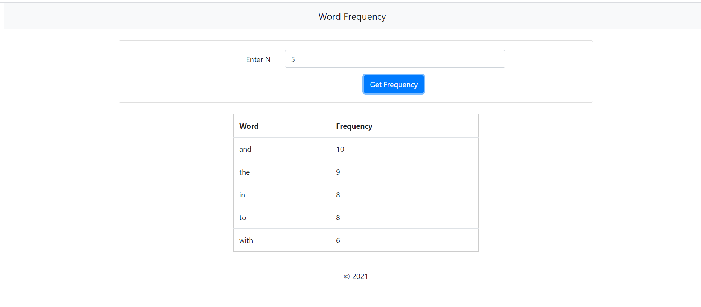

# Assignment-Invictus# Word Frequency React App

## Check Website Live on heroku : <https://word-frequency-s.herokuapp.com/>

## Task to complete

Design and build the following:

1. A Reactjs front end which accepts a number input N with a Submit button.

2. On entering a value and pressing submit, fetch the contents of <https://raw.githubusercontent.com/invictustech/test/main/README.md>

3. Find the top N most frequently occurring words in this file (DO NOT use a ready made module for frequency computation).

4. Display the top N words and their frequency of occurrence in the frontend, in a tabular format.

## To run it on localhost

1. Download this repo and unzip it.

2. Open frequency directory in terminal.

3. Run "npm install".

4. Run "npm start".

5. Open browser and hit <http://localhost:3000/>.

## Components

1. Header - It contains the website name at the top of website. On clicking it, the home page gets reloaded.

2. Input - It ask one number as input and then on clicking submit button, all the computation tasks happens. It fetches all the data from that external link and calculate the frequency of each word. Then that result is passed as props to Table component.

3. Table - It loops through the props.result and render in tabular format.

4. Footer - It contains the copyright details of website.

## Packages Used

1. react

2. react-dom

Note: No external package is used

## Test Case

Input = 5

Output Sceen:

